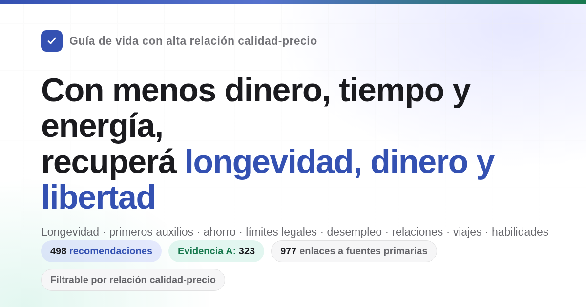

<div align="center">



# Guía de vida con alta relación calidad-precio

Cubre longevidad y prevención de enfermedades, accidentes y primeros auxilios, ahorro y finanzas personales, prevención de estafas y límites legales, respaldo durante el desempleo, riesgos de emprender, creación de plataformas y cumplimiento normativo, relaciones y crianza, viajes al extranjero y habilidades.
498 recomendaciones; cada una explica qué cuesta, qué devuelve y qué tan sólida es la evidencia. Las fuentes se limitan a artículos académicos y documentos oficiales.

[](https://vivirmejor.mati.ad/)
[](#índice)
[](#niveles-de-evidencia)
[](docs/核实记录/)
[](LICENSE)

**[Abrir la búsqueda en línea](https://vivirmejor.mati.ad/)** · [Índice](#índice) · [Glosario](#entender-los-términos-numéricos) · [Registro de verificación](docs/核实记录/) · [¿Conviene casarse? (texto largo)](docs/结婚划不划算.md) · [Lista de equipamiento de emergencia doméstica (texto largo)](docs/家庭应急装备清单.md) · [¿Conviene detenerse cuando le pasa algo a un desconocido? (texto largo)](docs/遇到陌生人出事该不该停.md) · [Qué permisos necesita una plataforma (texto largo)](docs/做平台要办哪些证.md)

</div>

---

## Qué preguntas intenta responder este libro

| Pregunta | Dónde buscar |
| --- | --- |
| ¿Qué cosas, con un costo casi nulo, reducen de forma apreciable la probabilidad de morir antes de tiempo? | [1. No mueras antes de tiempo](book/01-no-mueras-antes-de-tiempo.md) |
| ¿Cuánto acortan la vida fumar, beber, estar sentado y dormir poco? | [2. No mueras lentamente](book/02-不要慢慢死.md) |
| ¿Cómo cambio el hecho de no tener suficiente energía y sufrir interrupciones constantes? | [3. No desperdicies energía](book/03-no-desperdicies-energia.md) |
| ¿En qué se va todo el tiempo y cómo hago menos cosas sin beneficio? | [4. No desperdicies tiempo](book/04-no-desperdicies-tiempo.md) |
| ¿Cómo guardo el dinero para que no se lo coman los intereses, las comisiones y las estafas? | [5. No desperdicies dinero](book/05-不要浪费钱.md) |
| ¿Qué suplementos, paquetes de chequeos y «impuestos a la inteligencia» puedo dejar de comprar directamente? | [6. Lista de lo que no conviene](book/06-反面清单.md) |
| Si estoy desempleado, no me pagan o me quedé sin dinero, ¿qué puedo cobrar y dónde puedo pedir ayuda? | [7. Cómo vivir cuando no hay dinero](book/07-没钱的时候怎么活.md) |
| ¿A quién pertenecen legalmente la dote matrimonial, los bienes anteriores al matrimonio y las transferencias grandes durante el noviazgo? | [8. Seguridad legal y patrimonial](book/08-别把自己搭进去.md) |
| Si alguien me denuncia, me acusa o inventa hechos sobre mí, ¿qué hago primero y después puedo exigir responsabilidades o una indemnización? | [8. Seguridad legal y patrimonial](book/08-别把自己搭进去.md) |
| ¿Qué «trabajos ocasionales» y pequeños favores pueden convertir a una persona común en acusada penal? | [9. Límites legales que una persona común puede cruzar fácilmente](book/09-普通人容易踩的法律红线.md) |
| ¿Conviene conocer a muchas personas o insistir con una sola, puede funcionar una relación a distancia y qué hay que llevar para registrar el matrimonio? | [10. ¿Conviene tener una relación y casarse?](book/10-恋爱和结婚划不划算.md) |
| ¿Qué código escribir y qué trabajos aceptar pueden terminar en una condena? | [11. Límites legales que programadores y técnicos pueden cruzar fácilmente](book/11-程序员和技术人容易踩的红线.md) |
| Antes de pedir dinero prestado para abrir un negocio o una empresa, ¿qué es lo más importante que tengo que pensar? | [12. Emprender y hacer negocios](book/12-创业与做生意.md) |
| Si alguien cae al suelo y no respira, hay una hemorragia grave, un incendio o me pierdo, ¿qué hago primero? | [13. Emergencias: qué hacer primero](book/13-紧急情况.md) |
| Si me roban una cuenta o pierdo el celular, ¿qué hago primero? | [14. Seguridad de cuentas e información](book/14-账号与信息安全.md) |
| ¿Qué hago si retienen mi depósito, el propietario me echa o quiebra una empresa de alquiler a largo plazo? | [15. Alquilar y comprar vivienda](book/15-租房与买房.md) |
| Después de recibir un diagnóstico de enfermedad crónica, ¿cómo la manejo a largo plazo y gasto menos? | [16. Cómo vivir después de recibir un diagnóstico de enfermedad crónica](book/16-得了慢性病之后怎么活.md) |
| ¿Cómo organizar con anticipación la tutela, el testamento y el dinero de una persona mayor? | [17. Cuando hay una persona mayor en casa](book/17-家里有老人.md) |
| ¿Qué se puede cobrar al tener un hijo y cuánto tiempo y dinero consume? | [18. ¿Conviene criar hijos?](book/18-养孩子划不划算.md) |
| ¿Cómo se calculan las horas extra y las vacaciones, cuánto corresponde al ser despedido y cómo se reconoce y se cobra una lesión laboral? | [19. Durante y después del empleo, y accidentes laborales](book/19-在职离职和工伤.md) |
| Si el bebé acaba de nacer, ¿cuáles son las cosas más importantes? | [20. Cómo cuidar a un recién nacido](book/20-刚出生的孩子怎么带.md) |
| ¿A qué países conviene no viajar ahora y hasta dónde puede ayudar un consulado si pasa algo? | [21. Viajes al extranjero y seguridad fuera del país](book/21-出国旅行与境外安全.md) |
| ¿Cómo evitar problemas en un karaoke, un cibercafé o una sala de escape, y qué es más útil cuando hay mucho estrés? | [22. Cómo relajarse: lugares de ocio y reducción del estrés](book/22-怎么放松.md) |
| ¿Qué cosas realmente permiten recuperar la inversión: aprender soldadura, estudiar inglés o sacar una certificación? | [23. Qué habilidades conviene aprender](book/23-学什么技能划算.md) |
| Para una misma enfermedad, ¿cuánto más cuesta atenderse en un hospital terciario que en un centro comunitario? | [24. Cómo gastar menos y dar menos vueltas al recibir atención médica](book/24-看病.md) |
| Si llego al hospital con una lesión grave, ¿tengo que sacar turno y hacer fila o ir al área de clasificación de urgencias? Después del tratamiento, ¿conviene hacer una evaluación de discapacidad y tramitar el certificado correspondiente? | [24. Cómo gastar menos y dar menos vueltas al recibir atención médica](book/24-看病.md) |
| Si muere alguien de la familia, ¿qué hago primero, qué dinero puedo recuperar y qué gastos puedo evitar? | [25. Qué hacer después de una muerte](book/25-人走了以后要办什么.md) |
| Si creo un sitio web o una plataforma que cobra dinero, ¿qué permisos necesito y dónde pongo el servidor? | [26. Crear un sitio web o una plataforma](book/26-做一个网站或平台.md) |
| Si estoy embarazada o voy a dar a luz, ¿qué hago en cada momento y qué documentos tengo que tramitar antes del alta? | [27. Embarazo y parto](book/27-怀孕和生产.md) |
| Si quiero adelgazar o mejorar mi aspecto, ¿qué métodos pueden dañar mi cuerpo? | [28. No dañes tu cuerpo por tu apariencia](book/28-别为了外形把身体搞坏.md) |
| Si murió un familiar, me despidieron o recibí un diagnóstico grave, ¿qué es más importante durante los primeros meses? | [29. Después de un golpe importante](book/29-遭遇重大打击之后.md) |
| Después de que un niño empieza la escuela, ¿qué problemas físicos y psicológicos no deberían esperar hasta que terminen los exámenes? | [30. Niños en edad escolar](book/30-上学以后的孩子.md) |
| Después de los 18 años, además de estudiar y trabajar, ¿qué caminos existen y cuáles son sus requisitos? | [31. Qué caminos existen después de los 18 años](book/31-十八岁之后有哪几条路.md) |

## Cómo leerlo

- **Si querés filtrar por condiciones**: abrí la [búsqueda en línea](https://vivirmejor.mati.ad/). Permite combinar palabras clave, capítulos, nivel de evidencia y tres dimensiones de costo: si requiere dinero, cuánto tiempo requiere y si requiere perseverancia. Los datos se leen directamente de los textos de `book/`; al modificar el texto también se modifica la búsqueda.
- **Si querés leer en orden**: dentro de cada capítulo, las recomendaciones están ordenadas de mayor a menor relación calidad-precio. Podés empezar por las primeras.
- **Si no entendés la cadena de números**: cada recomendación tiene una línea «En palabras simples» que convierte las razones de riesgo y los intervalos de confianza de la sección «Beneficio» en expresiones cotidianas como «la probabilidad de morir durante el mismo período es aproximadamente un 20 % menor» o «cuántos días de detención y qué multa puede haber». Solo con esa línea alcanza para decidir; la sección «Beneficio» conserva todos los números y los intervalos de confianza originales para que puedas verificarlos.
- **Si solo querés ver las conclusiones más sólidas**: marcá el nivel de evidencia A en la búsqueda. Quedan las 323 recomendaciones con números concretos provenientes de metaanálisis o grandes ensayos.
- **Si solo querés ver lo que más conviene hacer**: marcá «relación calidad-precio: muy alta». Así obtenés 85 recomendaciones que no cuestan dinero, tiempo ni perseverancia y cuyo beneficio pertenece al nivel máximo. Si además elegís qué querés recuperar, obtenés la lista prioritaria de ese criterio.
- **Si los títulos de los capítulos empiezan con «no», no te preocupes**: el título indica el resultado que el capítulo intenta evitar —no morir antes de tiempo, no desperdiciar tiempo—, no que todo lo que sigue sean prohibiciones. El título de cada recomendación indica la acción y empieza con un verbo; puede decir qué hacer o qué no hacer. En un mismo capítulo hay ambas clases, por ejemplo «Convertí “voy a hacerlo” en “lo hago a tal hora, en tal lugar y cuando ocurra tal cosa”» y «No mires televisión ni noticias en desplazamiento continuo». Leé los títulos de las recomendaciones y no les apliques el tono del título del capítulo.

Cada recomendación tiene este formato:

```markdown
### 5. Cambiá la sal de mesa por sal baja en sodio (sal de potasio)
- Costo: unos yuanes más por paquete
- En palabras simples: en un ensayo aleatorizado de 20.000 personas, quienes cambiaron la sal de su casa por sal baja en sodio tuvieron aproximadamente un 12 % menos de probabilidad de morir y un 14 % menos de sufrir un accidente cerebrovascular durante cinco años. El resultado proviene de una asignación aleatoria y es más confiable que los datos observacionales habituales.
- Beneficio: accidente cerebrovascular −14 %, eventos cardiovasculares −13 %, mortalidad por todas las causas −12 %
- Nivel de evidencia: A
- Fuente: Neal B, et al. (2021). NEJM. https://doi.org/10.1056/NEJMoa2105675
- Notas: En discusión. No usar en caso de insuficiencia renal o si se toman diuréticos ahorradores de potasio. Otro estudio ecológico que abarcó 181 países encontró que los países con mayor consumo de sodio tenían una esperanza de vida más larga y una mortalidad por todas las causas más baja (β = −131 casos por gramo de sodio diario, R² = 0,60, P < 0,001), por lo que sus autores se oponen a considerar el sodio como causa de una vida más corta. Sin embargo, el estudio ecológico compara países y no personas: los países ricos pueden consumir más sal y vivir más, de modo que no se puede descartar el nivel económico como factor de confusión. Su evidencia es inferior a la del ensayo controlado aleatorizado anterior. Fuente: Messerli FH, Hofstetter L, Syrogiannouli L, et al. (2021). Sodium intake, life expectancy, and all-cause mortality. European Heart Journal, 42(21), 2103-2112. <https://doi.org/10.1093/eurheartj/ehaa947>
```

## Cuatro recursos

Esta guía no busca optimizar solamente la longevidad, sino cuatro recursos:

- **Longevidad**: vivir más y morir menos por causas que se podían evitar
- **Tiempo y energía**: que el tiempo de vida no sea ocupado por cosas sin beneficio y que la atención y la fuerza física se desperdicien menos
- **Dinero**: gastar menos en cosas inútiles y usar el dinero donde el beneficio sea más seguro
- **Libertad personal**: no terminar en un centro de detención o prisión por desconocer un límite legal

Cada recomendación responde dos preguntas: qué cuesta —dinero, tiempo, energía o perseverancia— y qué devuelve —cambio en la mortalidad por todas las causas, reducción de una causa específica de muerte, ahorro de tiempo y energía, ahorro de dinero, protección o libertad personal—. Las recomendaciones se ordenan por relación calidad-precio, no por categoría: las de costo casi nulo y gran beneficio aparecen primero.

**El beneficio se calcula según quién lo recibe, en distintos niveles.** De mayor a menor expectativa de que vuelva a beneficiarte: ① **vos mismo**; ② **tu pareja y tus familiares directos** —padres, hijos, abuelos y nietos—; ③ **amigos, compañeros de trabajo y otros familiares**, porque la reciprocidad puede hacer que la ayuda vuelva; ④ **desconocidos**, el nivel más bajo, aunque no es cero: la probabilidad de recibir algo a cambio es pequeña, no conocés el carácter de la otra persona y también existe el riesgo de que te reclame dinero, te acuse o tome represalias. Los niveles no se suman; cuando una recomendación llega al nivel ④, explica juntos los beneficios y los riesgos.

La sección de primeros auxilios se lee con este criterio: entre 38.227 casos de paro cardíaco extrahospitalario en China, el 79,2 % ocurrió en casa; aprender compresiones sirve primero para aplicarlas a alguien de tu propia familia. Reglas como «si ves a alguien ahogándose, no entres al agua» o «si presenciás una pelea, no intentes separarla con las manos» son también reglas de autoprotección: evitan que pases de testigo a segunda persona herida. Decidir si ayudar a un desconocido es una ponderación personal; las recomendaciones explican las cláusulas de exención, las acciones de autoprotección y los riesgos, sin presentarlo como una obligación.

Los números de mortalidad, tiempo y energía, dinero y consecuencias legales se mantienen en criterios separados; no se convierten unos en otros. Estos cuatro recursos corresponden a las cuatro opciones de «qué recuperar» en la búsqueda y no se comparan entre sí.

## Niveles de evidencia

Cada recomendación indica un nivel de evidencia:

| Nivel | Significado |
| --- | --- |
| A | Evidencia cuantificable proveniente de metaanálisis, grandes estudios de cohorte o ensayos controlados aleatorizados, con números concretos como HR, RR o porcentajes de reducción |
| B | Hay respaldo de investigación, pero es difícil cuantificarlo, o la evidencia proviene de una muestra pequeña o de un único estudio |
| C | Experiencia del autor o consenso general, sin bibliografía directa |

De las 498 recomendaciones, 323 son de nivel A, 126 de nivel B y 49 de nivel C. Además, 45 están marcadas como discutidas y 39 contienen un TODO pendiente de verificación. Las recomendaciones A/B discutidas indican la controversia y presentan la evidencia contraria. Todas las fuentes son primarias —artículos académicos con DOI o enlace a PubMed, o informes de organismos oficiales como la OMS, los CDC o la Oficina Nacional de Estadísticas—; no se usan resúmenes de segunda mano. Los números inciertos se marcan como «pendientes de verificación».

## Niveles de relación calidad-precio

El nivel de evidencia responde «¿qué tan confiable es este número?», no «¿conviene hacerlo?». Por eso cada recomendación también tiene un nivel de beneficio y un criterio; la búsqueda los combina con los tres costos para calcular una categoría:

| Dimensión | Valores | Cómo se determina |
| --- | --- | --- |
| Criterio | Recuperar longevidad / dinero / tiempo y energía / libertad personal | Según lo que esta recomendación devuelve principalmente. **Los criterios no se comparan entre sí**: «reducir un 12 % la mortalidad por todas las causas» y «ahorrar 500 yuanes al año» no se miden con la misma regla |
| Magnitud del beneficio | Grande / mediana / pequeña | Siempre que sea posible, se aplican mecánicamente los umbrales de la sección «Beneficio»: para longevidad, una reducción relativa ≥20 % es grande, 10–20 % es mediana y <10 % o solo un resultado indirecto es pequeña; para dinero, las cantidades del orden de decenas de miles son grandes, cientos a miles son medianas y decenas son pequeñas; para libertad personal, evitar responsabilidad penal es grande, evitar detención o sanción administrativa es mediano y evitar un conflicto civil es pequeño; para tiempo y energía, ahorrar horas por día es grande, horas por semana es mediano y un ahorro puntual es pequeño |
| Relación calidad-precio | Muy alta / alta / normal | Beneficio grande y los tres costos en cero = muy alta; beneficio grande con costos bajos, o beneficio mediano con costos en cero = alta; el resto = normal |

De las 498 recomendaciones, 88 tienen una relación calidad-precio muy alta (18 %), 248 alta (50 %) y 162 normal (33 %). La categoría intermedia es deliberadamente amplia: como la magnitud del beneficio solo tiene tres niveles, subdividirla más daría una falsa precisión.

**Esta categoría es una valoración del autor, no evidencia**; en esencia es de nivel C y es independiente del nivel de evidencia. Puede haber una recomendación A con relación calidad-precio normal —la vacuna contra el herpes zóster tiene una eficacia del 97,2 % en un ensayo de fase III, pero las dos dosis cuestan entre 3.000 y 4.000 yuanes y el herpes zóster rara vez es mortal—, o una recomendación C con relación calidad-precio muy alta —enviar el itinerario a tu familia antes de salir del país—. «Normal» no significa que no convenga hacerlo: todas las recomendaciones del libro son acciones sugeridas; esta categoría solo indica que tenés que ponderar ese gasto.

## Entender los términos numéricos

El texto intenta hablar en lenguaje cotidiano, pero al citar investigaciones aparecen algunos términos estadísticos inevitables. Consultá esta tabla si algo no se entiende; en la búsqueda en línea, al pasar el cursor sobre una palabra subrayada con puntos —o tocarla— también aparece una explicación.

<details>
<summary>Mostrar 40 términos (mortalidad por todas las causas, HR, RR, IC del 95 %, metaanálisis, IMC, LPR, depósito y anticipo…)</summary>

| Término | Significado |
| --- | --- |
| Mortalidad por todas las causas | Proporción de personas que mueren por cualquier motivo durante un período, sin distinguir la causa. El libro la usa para medir cuánto se vive. En las fuentes originales se llama mortalidad por todas las causas y su abreviatura en inglés es ACM |
| HR | Razón de riesgos. Cociente entre la velocidad a la que ocurren eventos —muerte, enfermedad— en dos grupos durante el mismo período. HR 0,87 significa un 13 % menos que el grupo de control; HR 1,21 significa un 21 % más |
| RR | Riesgo relativo. Cociente entre las probabilidades de que ocurra un evento en dos grupos; se interpreta igual que HR |
| OR | Razón de momios. Cociente entre las «posibilidades» de que ocurra un evento en dos grupos. Cuando el evento es poco frecuente se aproxima al RR; cuando es común puede exagerar la diferencia |
| IRR | Razón de tasas de incidencia; se interpreta igual que RR |
| RaR | Razón de cantidad de eventos —por ejemplo, cantidad de caídas—; se interpreta igual que RR |
| Razón de mortalidad estandarizada | SMR. Cantidad real de muertes de un grupo dividida por la cantidad esperada según la mortalidad de la población general de la misma edad. 5,86 significa 5,86 veces la mortalidad de personas de la misma edad |
| Diferencia de riesgos | Resta de las probabilidades de que ocurra un evento en dos grupos; muestra directamente cuántos casos adicionales hay por cada mil personas. Una razón solo indica cuántas veces; la diferencia de riesgos indica cuántas personas más son |
| IC del 95 % | Intervalo de confianza del 95 %. Rango en el que probablemente se encuentre el valor real. Si el intervalo de una razón cruza 1, o el de una diferencia cruza 0, la diferencia puede deberse al azar; el texto lo indica como «sin significación estadística» |
| RCT | Ensayo controlado aleatorizado. Las personas se dividen al azar en dos grupos, uno recibe la intervención y el otro no, y se comparan los resultados. Es el diseño que mejor muestra causalidad |
| Metaanálisis | Combinación estadística de los resultados de varios estudios para obtener una estimación general |
| Cohorte | Estudio de cohorte. Sigue durante años a un grupo de personas para observar quién sufre un evento. Puede mostrar una asociación, pero no demuestra completamente la causalidad |
| Observacional | Estudio observacional. Los investigadores observan sin intervenir; los resultados pueden estar afectados por factores de confusión y causalidad inversa, por lo que los números deben interpretarse con cautela |
| Factor de confusión | Tercer factor que influye a la vez en la causa y el resultado, haciendo que una asociación parezca causal. Las personas que comen verduras a menudo también hacen más ejercicio |
| Causalidad inversa | No es A lo que causa B, sino B lo que causa A. No es que dormir mucho provoque una muerte temprana; las personas gravemente enfermas pueden dormir más |
| d, g | Tamaño del efecto. Cuántas desviaciones estándar separan los promedios de dos grupos. 0,2 se considera pequeño, 0,5 mediano y 0,8 grande |
| r | Coeficiente de correlación. Grado en que dos cosas cambian en la misma dirección, entre −1 y 1; 0,1 es débil, 0,3 mediano y 0,5 fuerte |
| MET | Unidad de intensidad del ejercicio. 1 MET es estar sentado en reposo; caminar rápido equivale aproximadamente a 3–4 MET. MET·h es la intensidad multiplicada por las horas |
| GRADE | Estándar internacional para calificar la calidad de la evidencia en cuatro niveles: alta, moderada, baja y muy baja |
| Análisis por intención de cribado | Calcula el efecto según quién fue invitado y no según quién efectivamente se hizo el estudio; puede subestimar el efecto del cribado en quienes sí participaron |
| Paquete-año | Unidad de consumo de tabaco. Cantidad de paquetes diarios multiplicada por los años de consumo; 30 paquetes-año son un paquete diario durante 30 años |
| IMC | Índice de masa corporal. Peso en kilogramos dividido por la altura en metros al cuadrado |
| LDL | Colesterol unido a lipoproteínas de baja densidad, conocido como colesterol malo |
| HBsAg | Antígeno de superficie de la hepatitis B. Un resultado positivo indica infección por el virus de la hepatitis B |
| HPV | Virus del papiloma humano. La infección persistente por algunos tipos puede causar cáncer de cuello uterino |
| LDCT | Tomografía computarizada de tórax de baja dosis, con aproximadamente entre una quinta y una décima parte de la radiación de una tomografía común |
| PM2,5 | Partículas contaminantes del aire con un diámetro de hasta 2,5 micrómetros |
| NOVA | Método que clasifica los alimentos según su grado de procesamiento; los ultraprocesados pertenecen a la cuarta categoría |
| LPR | Tasa preferencial de préstamos. Tasa de referencia de los préstamos en China, publicada el día 20 de cada mes; las hipotecas y el límite de los préstamos privados también la toman como referencia |
| Decisión arbitral definitiva | La decisión del arbitraje laboral entra directamente en vigor y el empleador no puede volver a demandar ante un tribunal |
| Tasa bruta de matrimonio y tasa bruta de divorcio | Cantidad de matrimonios o divorcios registrados ese año por cada mil personas. La cantidad de divorcios dividida por la cantidad de matrimonios es otro criterio, llamado proporción divorcio-matrimonio; no deben confundirse |
| AED | Desfibrilador externo automático. Equipo de primeros auxilios rojo o amarillo frecuente en lugares públicos. Al encenderlo, da instrucciones de voz y decide por sí mismo si hace falta una descarga |
| RCP | Reanimación cardiopulmonar. Compresiones fuertes en el pecho durante un paro cardíaco para mantener la circulación de la sangre |
| Certificación 3C | Certificación obligatoria de productos en China. Los productos incluidos en el catálogo no pueden fabricarse ni venderse sin esa marca |
| Registro ICP | Trámite de registro ante el sistema del Ministerio de Industria y Tecnología de la Información antes de poner en línea un sitio web o una aplicación |
| Protección por niveles | Sistema de protección de la ciberseguridad. Clasifica los sistemas según su importancia y exige medidas de seguridad correspondientes |
| GPL | Licencia de código abierto. Al distribuir un producto que usa código bajo esta licencia, normalmente también hay que publicar el código fuente |
| Restricción de competencia | Acuerdo que impide trabajar para un competidor durante cierto tiempo después de dejar un empleo. La empresa debe pagar una compensación mensual y el período máximo es de dos años |
| Aporte de capital suscripto | Dinero que una persona se compromete a aportar al registrar una empresa. El compromiso debe pagarse dentro del plazo legal; no es una cifra meramente decorativa |
| Depósito y anticipo | El depósito tiene una penalidad: si incumple quien lo recibió, debe devolver el doble, hasta un máximo del 20 % del contrato. El anticipo es solo un pago adelantado y no tiene esa penalidad |

</details>

## Índice

1. [No mueras antes de tiempo](book/01-no-mueras-antes-de-tiempo.md): muertes por causas externas, gas y envenenamiento, vacunas, cribados, crisis psicológicas, equipamiento de emergencia doméstica y señales que requieren consulta, como sangre visible en la orina. Criterio: mortalidad por todas las causas o por una causa específica.
2. [No mueras lentamente](book/02-不要慢慢死.md): tabaco y alcohol, ejercicio, sueño, alimentación y sedentarismo. Criterio: mortalidad por todas las causas o por una causa específica.
3. [No desperdicies energía](book/03-no-desperdicies-energia.md): sueño, interrupciones, multitarea, fatiga de decisión y deudas interpersonales. Criterio: energía y tiempo.
4. [No desperdicies tiempo](book/04-no-desperdicies-tiempo.md): proyectos sin beneficio, costos hundidos, procrastinación, reuniones y viajes diarios. Criterio: tiempo.
5. [No desperdicies dinero](book/05-不要浪费钱.md): suscripciones, lotería, intereses, seguros, comisiones de fondos, pensión personal, seguro del auto, pagos anticipados, ventas en transmisiones en vivo, cuenta individual del seguro médico, estafas y reembolsos por compras de los hijos. Criterio: dinero.
6. [Lista de lo que no conviene](book/06-反面清单.md): cosas que parecen tener una buena relación calidad-precio pero en realidad no la tienen.
7. [Cómo vivir cuando no hay dinero](book/07-没钱的时候怎么活.md): asistencia, subsidios, búsqueda de empleo, alojamiento y comida, atención médica, reclamos por salarios adeudados y prevención de estafas. Criterio: dinero y protección.
8. [No te metas en problemas: seguridad legal y patrimonial](book/08-别把自己搭进去.md): accidentes de tránsito, bloqueo de pagos después de una estafa, voces e imágenes falsas generadas por IA, cómo actuar si te acusan o denuncian falsamente, límites entre la extorsión mediante amenazas de denuncia y tu propio reclamo, conflictos y violencia extrema por venganza, impulsos de herir y derecho de las personas cercanas a llevarte a recibir atención, qué hacer tras el acoso en línea, dote matrimonial, bienes anteriores al matrimonio, garantías, prevención de estafas, plazos de prescripción, ejecución de deudas, listas de morosos y responsabilidad por perros. Criterio: dinero y libertad personal.
9. [Límites legales que una persona común puede cruzar fácilmente](book/09-普通人容易踩的法律红线.md): rumores, insultos a héroes y mártires, mirar contenido extranjero sin reenviarlo, difusión de pornografía, lavado de dinero mediante trabajos ocasionales, falsificación de documentos para obtener préstamos, arrojar objetos desde altura, armas de imitación, drones, grabaciones ocultas, límites entre la entrega legal de un hijo que no se puede criar y la trata o el abandono, apuestas y productos de fauna silvestre. Criterio: libertad personal y dinero.
10. [¿Conviene tener una relación y casarse?](book/10-恋爱和结婚划不划算.md): estrategias para elegir pareja, límites legales del acoso, señales de interés, calidad de la relación, relaciones a distancia, trámites de registro, examen prematrimonial, balance de salud, tiempo y dinero, aportes de los padres para comprar una vivienda y deudas comunes del matrimonio, y costo de salida. Texto largo en [docs/结婚划不划算.md](docs/结婚划不划算.md).
11. [Límites legales que programadores y técnicos pueden cruzar fácilmente](book/11-程序员和技术人容易踩的红线.md): trampas, scraping, scripts para comprar entradas, borrar bases de datos, llevarse código fuente, aceptar ciertos desarrollos por encargo, restricciones de competencia, licencias de código abierto y registros. Criterio: libertad personal y dinero.
12. [Emprender y hacer negocios: no pierdas los ahorros de tu familia](book/12-创业与做生意.md): capital inicial, garantías, elección de la forma jurídica, registro, permisos, declaraciones fiscales, facturas, estafas tributarias, contratos, empleados, producción en serie, propiedad intelectual de productos y diseños, y salida del negocio. Criterio: dinero y responsabilidad legal.
13. [Emergencias: qué hacer primero](book/13-紧急情况.md): paro cardíaco, accidente cerebrovascular, accidente cerebrovascular de circulación posterior, accidente cerebrovascular ocular, infarto, disección aórtica, dolor de cabeza en trueno, hematoma subdural crónico, embolia pulmonar, hemorragia grave, mordeduras, quemaduras, shock anafiláctico, epilepsia, hipoglucemia, electrocución, monóxido de carbono, intoxicaciones y quemaduras químicas, objetos incrustados, inmovilización de fracturas, estafas, amenazas a la privacidad, golpe de calor, incendios, ahogamiento, extravío, hipotermia, mordeduras de serpiente, terremotos, animales salvajes, rayos, mal de altura y agua en la naturaleza; también incluye quién paga cuando ayudar sale mal: cómo levantar a una persona mayor que se cayó, qué hacer al presenciar una pelea y a quién reclamar si alguien se lesiona al ser auxiliado. Criterio: supervivencia y dinero; los últimos puntos también abarcan libertad personal.
14. [Seguridad de cuentas e información](book/14-账号与信息安全.md): autenticación de dos factores, contraseñas, tarjetas SIM, pérdida del celular, cargos no autorizados en tarjetas bancarias, dispositivos con sesión iniciada, permisos mínimos de las aplicaciones, reconocimiento facial y derechos de consulta y eliminación. Criterio: dinero e información personal.
15. [Alquilar y comprar vivienda](book/15-租房与买房.md): depósitos, desalojos violentos, cobros por intermediarios, supervisión de fondos, continuidad del alquiler después de una compraventa, verificación de la propiedad, cuentas especiales para fondos de transacciones y habitaciones divididas. Criterio: dinero.
16. [Cómo vivir después de recibir un diagnóstico de enfermedad crónica](book/16-得了慢性病之后怎么活.md): adherencia a la medicación, liquidación interprovincial de enfermedades crónicas especiales ambulatorias, registros de controles, no suspender el tratamiento para probar remedios, recetas prolongadas, médico de familia y cribado de complicaciones. Criterio: mortalidad por todas las causas y dinero.
17. [Cuando hay una persona mayor en casa](book/17-家里有老人.md): tutela anticipada, formas de testamento, cuentas y conversaciones, estafas de inversión para la vejez y de «vivienda a cambio de pensión», y seguro de cuidados de larga duración. Criterio: dinero y libertad personal.
18. [¿Conviene criar hijos?](book/18-养孩子划不划算.md): subsidios de crianza, licencia y asignación por maternidad, protección durante el embarazo, el parto y la lactancia, balance de tiempo y balance de dinero. Criterio: dinero y tiempo.
19. [Durante y después del empleo, y accidentes laborales](book/19-在职离职和工伤.md): pago de horas extra, vacaciones anuales y período de prueba; información sobre riesgos de enfermedades profesionales y tres controles de salud, protección frente a polvo, ruido y sustancias químicas; indemnizaciones N, por falta de preaviso y 2N, no firmar una renuncia voluntaria y conservar pruebas; plazos para reconocer accidentes laborales, empleadores sin seguro, evaluación de capacidad laboral y prestaciones por muerte laboral. Criterio: dinero.
20. [Cómo cuidar a un recién nacido](book/20-刚出生的孩子怎么带.md): sueño seguro, primera dosis contra la hepatitis B, vacunas del programa nacional, lactancia y alimentación complementaria, temperatura del agua para preparar fórmula, miel, vitamina K, señales de fiebre que requieren consulta, no sacudir al bebé y compras de pañales y artículos grandes. Criterio: mortalidad infantil y dinero.
21. [Viajes al extranjero y seguridad fuera del país](book/21-出国旅行与境外安全.md): niveles de alerta, línea 12308, límites de la protección consular, seguro médico internacional, estafas de empleos bien pagos en el extranjero, pérdida de documentos, licencias de conducir extranjeras y registro de intermediarios. Criterio: dinero y libertad personal.
22. [Cómo relajarse: lugares de ocio y reducción del estrés](book/22-怎么放松.md): salidas de emergencia, precios visibles, límites relacionados con drogas, no aceptar objetos de desconocidos, registro con nombre real en cibercafés y elección del lugar para juegos de rol o salas de escape; ejercicio, atención plena, respiración, vínculos sociales y espacios verdes. Criterio: dinero y libertad personal, además de energía y mortalidad por todas las causas.
23. [Qué habilidades conviene aprender](book/23-学什么技能划算.md): si seguir estudiando o empezar a trabajar —edad mínima para el trabajo infantil, educación y mortalidad, estructura educativa nacional, exención de matrícula, becas y préstamos, vías de ascenso desde la formación profesional y cómo calcular la decisión—; retorno de la educación, certificados falsos, subsidios de capacitación, dimensiones resistentes a la automatización, niveles de habilidades y cómo consultar profesiones con escasez. Criterio: retorno monetario y tiempo; uno de los puntos tiene criterio de mortalidad.
24. [Cómo gastar menos y dar menos vueltas al recibir atención médica](book/24-看病.md): atención por niveles y derivaciones, cálculo continuo del deducible, diferencias en porcentajes de reembolso, turnos reservados, evaluación de necesidad de atención fuera de la provincia, conservación y sellado de historias clínicas, orden de clasificación en urgencias, ayuda de emergencia para enfermedades cuando no se puede pagar, momento de la evaluación de discapacidad y cómo tramitar el certificado. Criterio: dinero y tiempo.
25. [Qué hacer después de una muerte](book/25-人走了以后要办什么.md): denuncia y certificado de defunción, traslado y cremación, objeciones a la causa de muerte y autopsia, baja del registro domiciliario, lista de servicios funerarios básicos, infracciones de precios, registro de intermediarios, saldo del fondo de vivienda y prestaciones de seguridad social, y derechos sobre la información personal de la persona fallecida. Criterio: dinero.
26. [Crear un sitio web o una plataforma: permisos, registros y servidores](book/26-做一个网站或平台.md): límites penales de los pagos y liquidaciones, permisos y registros ICP, permisos para transmisiones en vivo y contenido audiovisual, verificación y reporte fiscal de la plataforma, moderación de contenido, identidad real, menores de edad, notificación y eliminación, transferencias de datos al extranjero y elección del servidor. Criterio: libertad personal y dinero. Texto largo en [docs/做平台要办哪些证.md](docs/做平台要办哪些证.md).
27. [Embarazo y parto: desde descubrir el embarazo hasta tramitar los documentos del alta](book/27-怀孕和生产.md): ácido fólico, apertura de la libreta de salud maternoinfantil y controles prenatales gratuitos, cribado de tres enfermedades y prevención de la transmisión maternoinfantil, tabaco y alcohol durante el embarazo, aspirina y diabetes gestacional, señales que requieren ir inmediatamente al hospital, qué hacer si se rompe la bolsa, parto sin dolor, indicaciones de cesárea, seguro de maternidad, certificado médico de nacimiento, cribados del recién nacido, seguro y registro domiciliario, y control a los 42 días del parto. Criterio: mortalidad y dinero.
28. [No dañes tu cuerpo por tu apariencia](book/28-别为了外形把身体搞坏.md): dietas extremas y trastornos alimentarios, institución estética y credenciales del médico principal, zonas de riesgo y ceguera por rellenos faciales, productos adelgazantes con sibutramina ilegal, esteroides anabólicos, medicamentos para adelgazar y hormonas sexuales solo con receta y controles, y evaluación de la imagen corporal. Criterio: mortalidad —incluidos resultados de salud—; los dos puntos sobre medicina estética también abarcan la libertad personal.
29. [Después de un golpe importante](book/29-遭遇重大打击之后.md): ventana cardiovascular durante el primer mes de duelo, primera semana después de un diagnóstico grave, desempleo, primeros seis meses de viudez, duelo por suicidio, cómo alojar y cuidar a los hijos tras la muerte de un progenitor, dónde consultar si el duelo se estanca, divorcio, líneas 12356 y 12355 y no tomar decisiones irreversibles durante una crisis de estrés. Criterio: mortalidad por todas las causas; los dos últimos puntos son monetarios.
30. [Niños en edad escolar](book/30-上学以后的孩子.md): urgencias que se calculan por horas, no retrasar un tratamiento por los exámenes, qué hacer ante el acoso escolar, dos horas diarias al aire libre, informes de controles médicos escolares, cribado de depresión adolescente, productos que prometen «curar la miopía», reglas estrictas sobre sueño y tareas, conservación de la matrícula durante una pausa escolar, refracción con dilatación y controles, y sellado de fosas y fisuras. Criterio: mortalidad y resultados de salud, con uno o dos puntos adicionales de dinero y tiempo.
31. [Qué caminos existen después de los 18 años](book/31-十八岁之后有哪几条路.md): requisitos legales de ocho caminos; servicio militar —registro, dos años de servicio obligatorio, sanción conjunta por negarse a servir, compensación de matrícula y acceso a estudios, asignación y registro dentro de 30 días, paga de retiro, antigüedad y beneficios fiscales—; reclutamiento dirigido desde proyectos de servicio comunitario; incorporación de docentes de zonas rurales después del período obligatorio; bomberos y personal civil militar; examen autodidacta, examen de educación para adultos y universidad abierta; seguridad social del empleo flexible; y cobertura de accidentes laborales para repartidores. Criterio: dinero y tiempo; el punto sobre negarse al servicio también abarca la libertad personal.

Dentro de cada capítulo, las recomendaciones están ordenadas de mayor a menor relación calidad-precio. Títulos como «No mueras antes de tiempo» o «No desperdicies tiempo» indican el resultado que el capítulo intenta evitar; para saber si una recomendación propone hacer o no hacer algo, hay que mirar su propio título. También hay textos largos en [docs/家庭应急装备清单.md](docs/家庭应急装备清单.md), [docs/做平台要办哪些证.md](docs/做平台要办哪些证.md), [docs/结婚划不划算.md](docs/结婚划不划算.md) y [docs/遇到陌生人出事该不该停.md](docs/遇到陌生人出事该不该停.md). El proceso de verificación de cada fuente está registrado en [docs/核实记录](docs/核实记录/).

El `index.html` de la raíz del repositorio es la página de búsqueda en línea: permite filtrar recomendaciones por palabra clave, capítulo, nivel de evidencia y dimensiones de costo —dinero, tiempo y perseverancia—. Los datos se leen directamente de este archivo. Para habilitarla, hay que configurar GitHub Pages como «Deploy from a branch», elegir la rama `main` y el directorio `/`.

## Texto principal

El texto principal está dividido por capítulos en 30 archivos dentro de [book/](book/); hacé clic en los capítulos del índice para abrirlos. La división fue necesaria porque el archivo único ya superaba el límite de 512 KB del Markdown renderizado por GitHub y los capítulos posteriores no aparecían. La [búsqueda en línea](https://vivirmejor.mati.ad/) lee y combina esos archivos, por lo que el uso no cambia.
